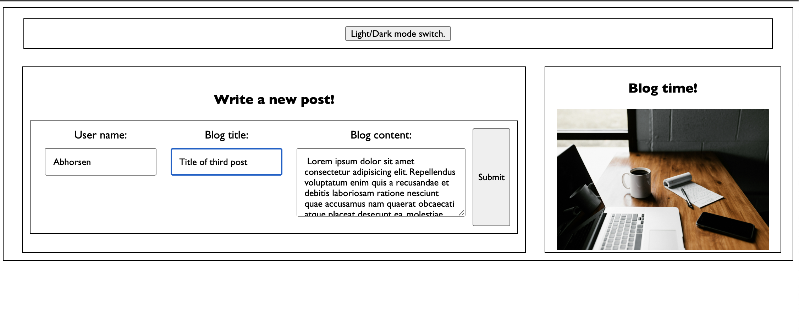
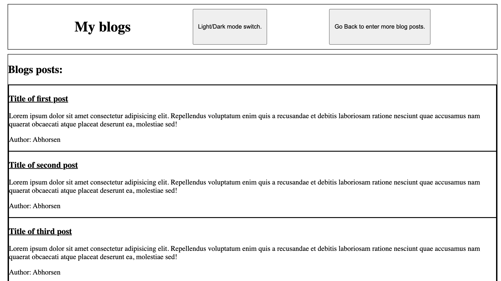

# Personal Blog

For this assignment, I created the HTML, CSS, and Javascript from scratch. There are two HTML pages. One to allow the user to enter a blog post and one to view all the posts. I created a button to switch light and dark modes as well as a back button from the blog posts page to the new blog post page. All the blog posts are stored in local storage as well as the light/dark mode setting.

The following images show the 2 pages of the web application:

## Link to Deployed Version
[Click here to see the deployed version](https://jengelfling.github.io/my-blog/)